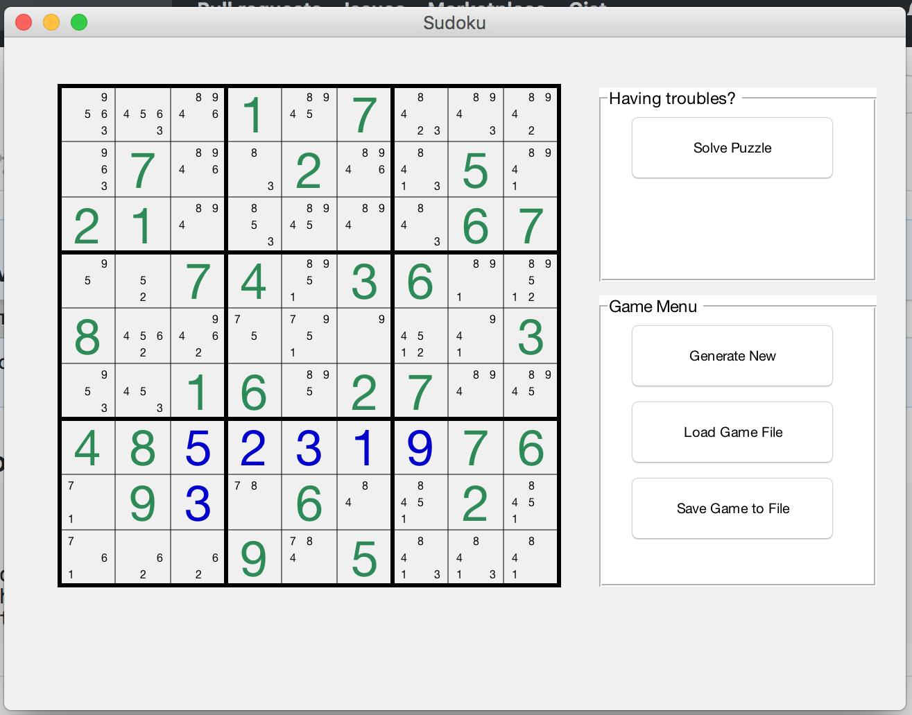

# Simple SUDOKU game

## Installation
1. Install Matlab (my version was R2016b)
2. clone repo
3. run create_ui.m file and load game000.mat (using game menu)

## How to play
game automatically checks which input options are actually possible
1. load game from file or click "generate new"
2. click on one of available N options to set a number for a field
3. click on already set number (blue ones) to dismiss

## Screenshot

